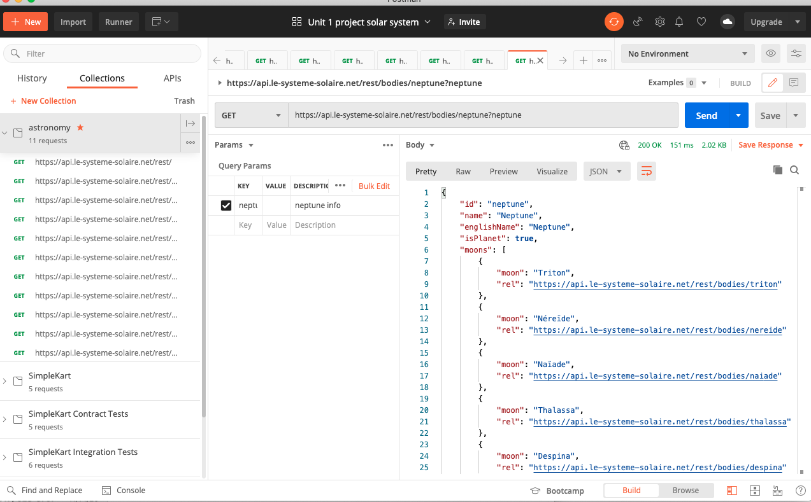
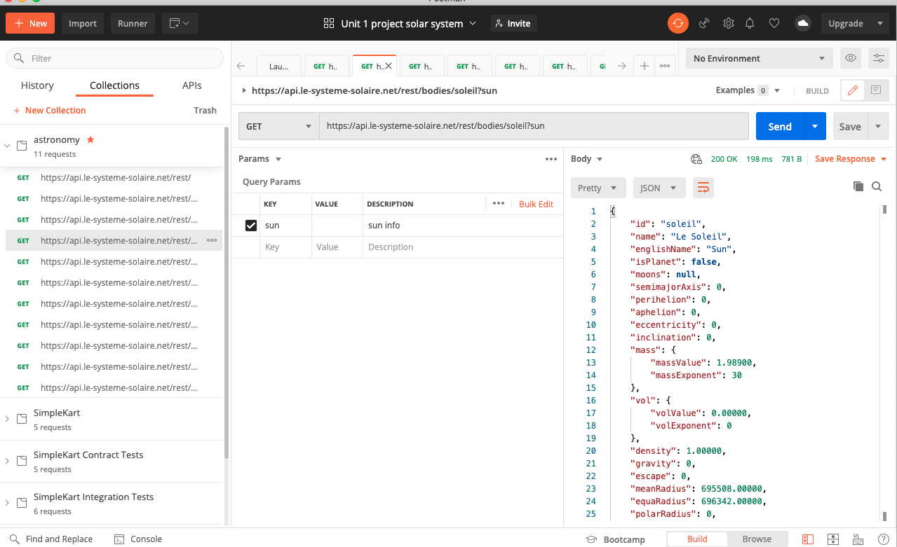

# Unit-1-Project

# Solar System Project Unit 1 Code 
This project is making an interactive learning experience about the solar system. Click on a planet and learn some interesting information about it. Click on the Star Trek tng ship and find out some fun facts! 

## Mobile layout 

**HTML**
* Add **HTML** template and link CSS and JS
* Add section dividers for **planets**, **text**, and **buttons**
* Add **H1** title, **planets containers** & and **ship container** & order them 
* Assign class or Id to planets and buttons
* Add container that will be displaying the **api** info
* Add buttons for planets
* Add buttons for sound and dark mode 
* Add containers for bottom and top border color
* Add google fonts and bootstrap link 

**CSS** 
* Design layout and place planets on the page
* Add _flex_ to container divs, assign colors, size, fonts, _adjust bootstrap_ 
* Make **dark mode** button color options / display
* Test layout responsive design 
* Add in **@media** to adjust the layout for desktop version 
* Test mobile and desktop versions
* Set width, hight, and colors, to api container div

**JS**
* Add in layout dividers for **constants, variables, cached elements, event listeners, and functions** 
* Add variable _array_ to store the planets and another variable _array_ to store the ship  info 
* **DOM** link the elements on HTML to js variables in cached element section 
* DOM link the buttons, body, and container of information 
* Add **click** event listeners to sound button, dark mode, and planets
* Add event listener to planet buttons
* **Fetch** function to _Get_ api, **.then** function for response & make object to store keys into and push into that object. Call render function
* **.catch** function to console.log any errors
* Add event listener to light and dark button on click
* Make a function to select the keys, index, and create div to push info into
* Append that information to container for each planet and ship
* In **appending div** function, make new div and add in bootstrap _blockquote_ data for a card, append it to container for info, set keys added in
* Add function to check for color scheme and change dark mode
* Add render function, clears out what's inside each container of info, append to div
* Test api call 
* Add in **audio** function and add _click_ event listener to the audio button 
* Test audio 
* Test dark mode button 
* Test responsive layout and make sure everything functions 

