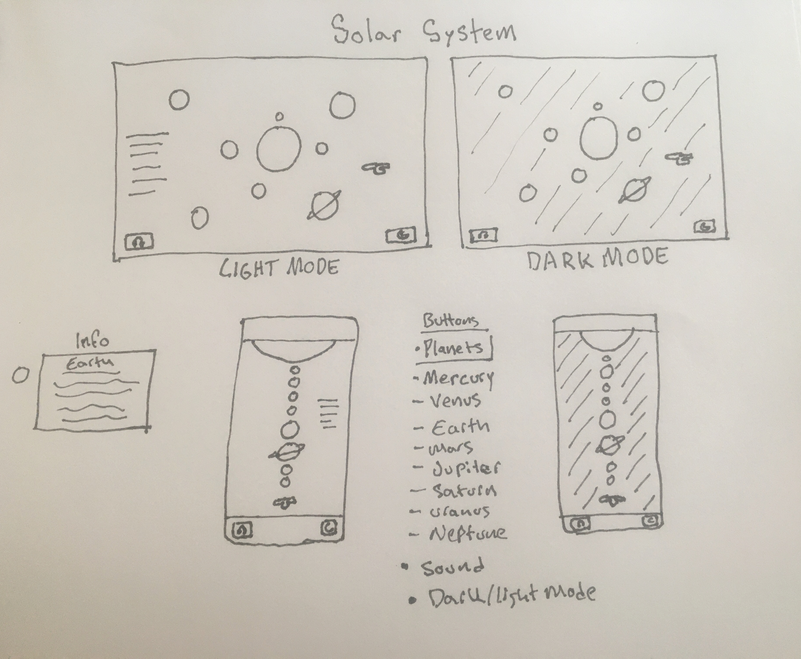

# Unit-1-Project

#Solar System Project Unit 1 Code 

##Mobile layout 
* Add _HTML_ template and link CSS and JS
* Add section dividers for *planets*, *text*, and *buttons*
* Add _H1_ title, _planets containers_ & and _ship container_ & order them 
* Add container that will be displaying the button _api_ info
* Add buttons for planets
* Add buttons for sound and dark mode 
* Add containers for bottom and top border color
* Add google fonts and bootstrap link 

// CSS design layout and place planets on the page
// add flex to container divs
// assign colors, size, fonts, adjust bootstrap 
// make dark mode button color options / display
// test layout responsive design 
// Add in @media to adjust the layout for desktop version 
// text mobile and desktop versions

// JS add in layout dividers for constants, variables, cached elements, event listeners, and functions 
// add variable array to store the planets and another variable array to store the ship info 
// link the elements on HTML to js variables in cached element section 
// link the buttons, body, and container of information 
// add click event listeners to sound button, dark mode, and planets
// fetch api, and make objects that get pushed to array
// make render function that clears out the data every time you click
// In render add index to every info data and append it to container with key values selected from API
// In appending div function, make new div and add in bootstrap blockquote data for a card, append it to container for info, set keys added in
// add function for dark mode, to change to a dark scheme
// add constant for dark mode variable object
// add function fo dark mode to switch between light and dak & set attribute class to body
// text api call 
// add in audio function and add click event listener to the audio button 
// text audio 
// text dark mode button 
// test responsive layout and make sure everything functions 

